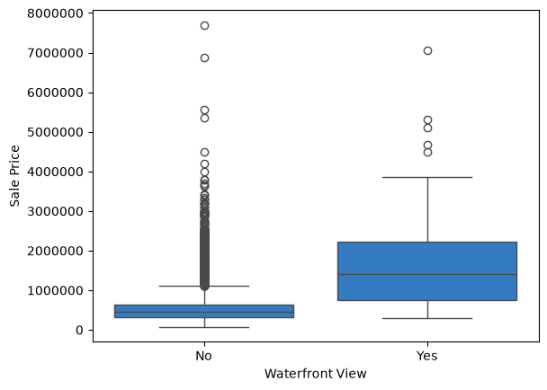
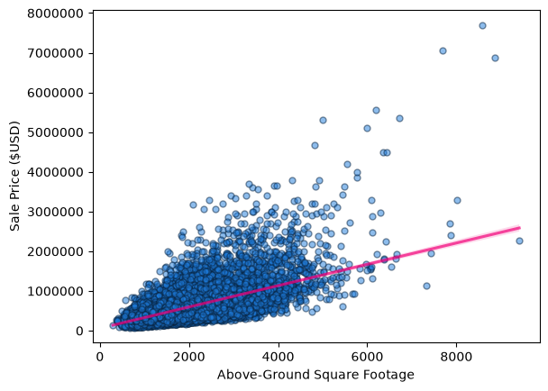

# Real Estate Sales Data Analysis

Predicting residential sale prices in King County, Washington, using regression models built on 21,613 home sales from May 2014 to May 2015.

## Key Findings

* Living area (`sqft_living`) has the strongest correlation with price (r = 0.70), followed by King County building grade (r = 0.67).
* Waterfront homes have a median sale price roughly 3x higher than non-waterfront homes.
* Adding second-order polynomial features to a Ridge model raised test-set R² from 0.65 to 0.72.
* Cross-validation confirms the polynomial model's improvement is real, not an artifact of the train/test split: it holds across all 5 folds with a low standard deviation.

## Results

|Model|Features|R²|Evaluated on|
|-|-|-|-|
|Linear regression|`sqft_living` only|0.49|Training data|
|Linear regression|13 features|0.66|Training data|
|Pipeline (scaling + polynomial + linear)|13 features|0.76|Training data|
|Ridge (α = 0.1)|13 features|0.65|Test set (15%)|
|Ridge (α = 0.1) + degree-2 polynomial|13 features|0.72|Test set (15%)|
|Ridge (α = 0.1)|13 features|0.658 ± 0.008|5-fold cross-validation|
|Ridge (α = 0.1) + degree-2 polynomial|13 features|**0.742 ± 0.021**|5-fold cross-validation|
 



## Approach

1. **Cleaning:** dropped the ID column, converted date column from raw string to datetime, and filled missing bedroom and bathroom values with the column means.
2. **EDA:** looked at feature distributions, outliers, and each feature's correlation with price.
3. **Modelling:** built single-feature and multi-feature linear regressions, then a scikit-learn pipeline combining scaling and polynomial features.
4. **Refinement:** used Ridge regularization on an 85/15 train/test split, with and without polynomial features.
5. **Validation:** compared both Ridge models with 5-fold cross-validation, refitting preprocessing inside each fold.

## Limitations and Next Steps

* Price is heavily right-skewed; a log transform of the target would likely improve fit.
* Location (zipcode, lat/long) is mostly unused; encoding neighbourhood effects is the obvious next improvement.
* The Ridge alpha was fixed at 0.1. Tuning it with a grid search could improve results.

## Data

[King County House Sales dataset](https://www.kaggle.com/datasets/harlfoxem/housesalesprediction) (public domain). See the notebook for the full data dictionary.

## Running It

```
pip install -r requirements.txt
jupyter notebook WA-realestate.ipynb
```

## Tools

Python, pandas, NumPy, Matplotlib, Seaborn, scikit-learn

*Completed as part of the IBM Data Science Professional Certificate.*

