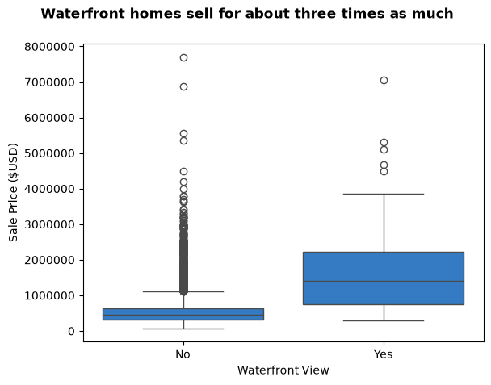
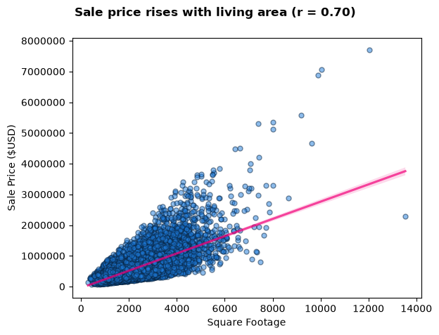

# Real Estate Sales Data Analysis

Predicting residential sale prices in King County, Washington, using regression models built on 21,613 home sales from May 2014 to May 2015.

## Key Findings

* Living area (`sqft_living`) has the strongest correlation with price (r = 0.70), followed by King County building grade (r = 0.67).
* Waterfront homes have a median sale price roughly 3x higher than non-waterfront homes.
* Adding second-order polynomial features to a Ridge model raised test-set R² from 0.65 to 0.72.
* Cross-validation confirms the polynomial model's improvement is real, not an artifact of the train/test split: it holds across all 5 folds with a low standard deviation.
* Adding location (longitude and zipcode) and fitting on log price raised cross-validated R² from 0.740 to 0.870 and cut the mean absolute error from $116k to $73k.
* Changing the Ridge alpha anywhere from 0.01 to 10 made no difference to R²; larger values made it worse.

## Results

|Model|Features|R²|Evaluated on|
|-|-|-|-|
|Linear regression|`sqft_living` only|0.49|Training data|
|Linear regression|11 features|0.66|Training data|
|Pipeline (scaling + polynomial + linear)|11 features|0.76|Training data|
|Ridge (α = 0.1)|11 features|0.65|Test set (15%)|
|Ridge (α = 0.1) + degree-2 polynomial|11 features|0.72|Test set (15%)|
|Ridge (α = 0.1)|11 features|0.658 ± 0.007|5-fold cross-validation|
|Ridge (α = 0.1) + degree-2 polynomial|11 features|0.740 ± 0.021|5-fold cross-validation|
|Ridge (α = 0.1) + degree-2 polynomial|11 features + `long` + zipcode|0.862 ± 0.011|5-fold cross-validation|
|Ridge (α = 0.1) + degree-2 polynomial, log price|11 features + `long` + zipcode|**0.870 ± 0.020**|5-fold cross-validation|
 
 

## Approach

1. **Cleaning:** dropped the ID column and converted the date column from raw string to datetime. The data has no blank cells, but 13 homes list 0 bedrooms and 10 list 0 bathrooms; I treated these, and one 33-bedroom typo, as missing and filled them with the column medians.
2. **EDA:** looked at feature distributions, outliers, and each feature's correlation with price.
3. **Modelling:** built single-feature and multi-feature linear regressions, then a scikit-learn pipeline combining scaling and polynomial features. For house size, the models use `sqft_living` alone: `sqft_above` and `sqft_basement` add up to it exactly, and keeping the basement split raised cross-validated R² by only 0.004.
4. **Refinement:** used Ridge regularization on standardized features with an 85/15 train/test split, with and without polynomial features.
5. **Validation:** compared both Ridge models with 5-fold cross-validation, refitting preprocessing inside each fold.
6. **Improvement:** added longitude and a one-hot encoded zipcode, fitted the model on log price, and checked Ridge alpha values from 0.01 to 1,000.

## Limitations

* Predictions are converted back from log price, so they estimate the typical (median) price for a home's features and run slightly low on average.
* The sales cover one year (May 2014 to May 2015), so the model reflects that year's market.

## Data

[King County House Sales dataset](https://www.kaggle.com/datasets/harlfoxem/housesalesprediction) (public domain). Save the CSV as `data/kc_house_data.csv`. See the notebook for the full data dictionary.

## Running It

```
pip install -r requirements.txt
jupyter notebook WA_realestate.ipynb
```

`python plots.py` rebuilds the two images in `images/`.

## Tools

Python, pandas, NumPy, Matplotlib, Seaborn, scikit-learn

*Initially completed as part of the IBM Data Science Professional Certificate and later expanded upon as a personal project.*

